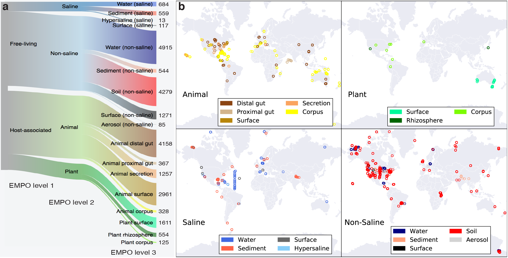
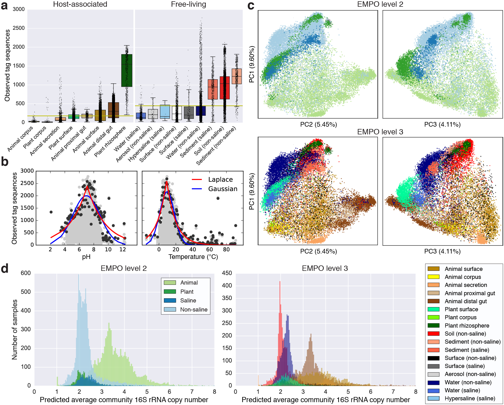
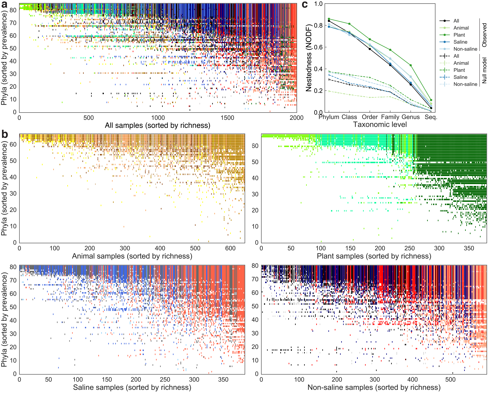
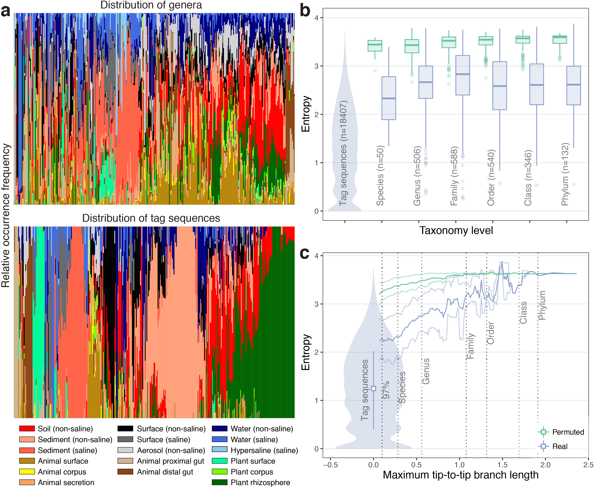
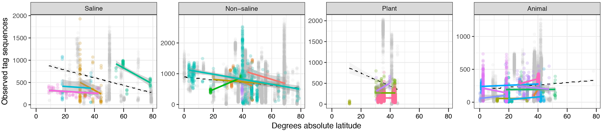

## figures

Code to generate the figures in "A communal catalogue reveals Earth’s multiscale microbial diversity", *Nature* (2017), by Thompson et al. This manuscript describes the meta-analysis of EMP 16S Release 1, the first 97 studies subjected to 16S rRNA amplicon sequencing through the [Earth Microbiome Project](http://www.earthmicrobiome.org).

Input data files for generating the figures below are found in several places:

* All data files (except sequences) required to generate the figures below are available from ftp://ftp.microbio.me/emp/release1; full contents are listed in `data/ftp_contents.txt`. 
* All data files (except sequences) for this manuscript are archived with Zenodo, available from the DOI http://doi.org/.
* Sequences files are available directly from EBI (see below).
* The mapping file (metadata) for analyses unless otherwise noted is `emp_qiime_mapping_qc_filtered.tsv` in `data/mapping_files`.
* Smaller data files (<100 GB) are also stored in `data`.

### Amplicon sequence processing: generation of OTU/sequence observation tables from demultiplexed fasta data

This section describes the commands to download the raw sequence data from EBI and perform OTU picking using different methods, including generating phylogenetic trees and taxonomies for reference sequences, if necessary.

**Step 1. Download sequences** 

Sequences can be downloaded directly from EBI using the script `download_ebi_fasta.sh` or `download_ebi_fastq.sh` in `code/download-sequences`, depending on whether fasta or fastq sequences are desired. Fasta sequences are used by the steps below. The sequences from EBI are demultiplexed and minimally quality filtered according to the default parameters of the QIIME 1 command [split_libraries_fastq.py](http://qiime.org/scripts/split_libraries_fastq.html).

**Step 2. OTU picking and Deblur** 

Four separate OTU picking procedures were run on the EMP Release 1 data: de novo using Deblur, closed-reference using Greengenes 13.8, closed-reference using Silva 123, and open-reference using Greengenes 13.8.

*Deblur.* Deblur sOTU (tag sequence) picking was done using a pre-release version of [Deblur](https://github.com/biocore/deblur). That workflow can be called from the script `run_deblur_emp_original.sh` in `code/03-otu-picking/deblur`. The analogous workflow using the published distribution of Deblur can be called from the script `run_deblur_emp_new.sh`.

*Closed-reference Greengenes 13.8.* Closed-reference OTU picking against Greengenes 13.8 was done using the QIIME 1 script [pick_closed_reference_otus.py](http://qiime.org/scripts/pick_closed_reference_otus.html).

*Closed-reference Silva 123.* Closed-reference OTU picking against Silva 123 16S was done using the QIIME 1 script [pick_closed_reference_otus.py](http://qiime.org/scripts/pick_closed_reference_otus.html).

*Open-reference Greengenes 13.8.* Closed-reference OTU picking against Greengenes 13.8 was done using the QIIME 1 script [pick_open_reference_otus.py](http://qiime.org/scripts/pick_open_reference_otus.html).

**Step 3. Phylogenetic trees**

*Deblur tree.* Deblur sequences were inserted into the Greengenes reference tree using [SEPP](https://github.com/smirarab/sepp). The code for this method is in `code/phylogenetic-placement/run_sepp.sh`.

*Open-reference tree.* Reference sequences from the open-reference OTU picking were aligned using [PyNAST](https://biocore.github.io/pynast/) and the tree built using [FastTree](https://www.msi.umn.edu/sw/fasttree).

**Step 4. Rarefaction of tables**

Deblur and OTU tables were rarefied (subsampled) to generate equal numbers of observations (sequences) per sample, used in many of the analyses as described below. Deblur tables were rarefied to 5000 observations per sample, and reference-based OTU tables were rarefied to 10000 observations per sample, each using the QIIME 1 script [single_rarefaction.py](http://qiime.org/scripts/single_rarefaction.html). 

**Step 5. Subsets of tables**

Deblur and OTU tables were subset to generate tables with more even representation across sample types and studies, used in many of the analyses as described below. Subsetting of the tables is accomplished by running the IPython notebooks `observation_table.ipynb` and `subset_samples_by_empo_and_study.ipynb` in `code/04-rarefaction-and-subsets`.

### Metadata processing

QIIME mapping files were downloaded from https://qiita.ucsd.edu and refined to fix errors, standardize formatting, and add fields specific for this investigation. The IPython notebook for this metadata processing is `metadata_refine.ipynb` in `code/01-metadata`.

### Generating figures

#### Figure 1. Environment type and provenance of EMP samples included in this meta-analysis

**Figure 1a** 

Sankey generated from mapping file column `empo_3` using Google Charts [Sankey Diagram](https://developers.google.com/chart/interactive/docs/gallery/sankey).

**Figure 1b** 

Map generated from mapping file columns `latitude_deg` and `longitude_deg` using IPython notebook `map_samples_by_empo.ipynb` in `code/01-metadata`.

#### Figure 2. Alpha-diversity, beta-diversity, and predicted average 16S rRNA gene copy number

**Figure 2a**

Alpha-diversity for the Deblur 90-bp table (QC-filtered) subset was run using the script `alpha_diversity.py` in `code/05-alpha-diversity`. The results for the Deblur 90-bp table rarefied to 5000 sequences per sample were added to the mapping file as the columns adiv_observed_otus, adiv_chao1, adiv_shannon, and adiv_faith_pd.

**Figure 2b**

**Figure 2c**

**Figure 2d**

<!--
Ken's repo: https://github.com/klocey/emp_macroeco
-->

#### Figure 3. Nestedness of community composition

**Figure 3a** 

**Figure 3b** 

**Figure 3c** 

<!--
A GitHub repository that can be used to easily replicate the results is located here:

https://github.com/jladau/Nestedness.EMP

As noted in the repository, the data files that were used are posted at this Dropbox link:

https://www.dropbox.com/s/velnv86z1l81ilx/nestedness_emp_data.tar.gz?dl=0

Is there an EMP GitHub repository where the data can be posted, or alternatively, can you point to where these files are already posted? For consistency with the file naming conventions that I used, some of the files in Dropbox are renamed as follows (they have also each been rarefied to 5000 reads):

otu_subset.emp_deblur_90bp.subset_2k.lt_1.0_pc_samp.biom -> Global.Global2000Subset.BacteriaSubset1.EMP.biom
otu_subset.emp_deblur_90bp.subset_2k.lt_5.0_pc_samp.biom -> Global.Global2000Subset.BacteriaSubset5.EMP.biom
otu_subset.emp_deblur_90bp.subset_2k.lt_10.0_pc_samp.biom -> Global.Global2000Subset.BacteriaSubset10.EMP.biom
emp_deblur_90bp.subset_2k.rare_5000.biom -> Global.Global2000Subset.Bacteria.EMP.biom
-->

#### Figure 4. Specificity of tag sequences for environment

**Figure 4a** 

**Figure 4b** 

**Figure 4c** 

#### Figure S1. Physicochemical properties of the EMP samples

The pairplot of physicochemical metadata was generated using IPython notebook `physicochemical_pairplot.ipynb` in `code/01-metadata`.

#### Figure S2. Median sequence length per study after quality trimming

The histogram of median sequence length after trimming (output of split_libraries.py, i.e., sequences downloaded from EBI) was generated using IPython notebook `sequence_length.ipynb` in `code/02-sequence-processing`.

#### Figure S3. Comparison of Greengenes and SILVA rRNA databases for reference- based OTU picking and alpha-diversity calculation

#### Figure S4. Beta-diversity among all EMP samples using principal coordinates analysis (PCoA) of weighted UniFrac distance

#### Figure S5. Sequence length effects on observed diversity patterns

#### Figure S6. Tag sequence prevalence patterns

#### Figure S7. Effect sizes of predictors on alpha- and beta-diversity

#### Figure S8. Confusion matrix and receiver operating characteristic (ROC) curve for random forest classifier of samples to environment types

#### Figure S9. Microbial transmission among environments

#### Figure S10. Correlation of microbial richness with latitude

#### Figure S11. NODF scores of nestedness across samples by taxonomic level

#### Figure S12. Subsets of the EMP dataset with even distribution across samples and studies

#### Figure S13. EMP Trading Cards: distribution of 16S rRNA tag sequences across the EMP

